# 📱 dam2_2627_a — App de mensajes con Flutter + Firebase


Proyecto de clase de **2º de DAM** (Desarrollo de Aplicaciones Multiplataforma). Es una app sencilla
en la que el usuario:

1. 🔐 **Se registra o inicia sesión** con email y contraseña (Firebase Authentication).
2. 👤 **Crea su perfil** (edad y altura), que se guarda en Cloud Firestore.
3. 💬 **Ve su lista de mensajes** en tiempo real, puede añadir mensajes nuevos y
4. 🔎 **Abre el detalle** de cualquier mensaje pulsando sobre él.

> 🎯 **Objetivo didáctico:** ver en un proyecto pequeño y completo cómo se conectan las piezas
> típicas de una app real: pantallas, navegación, estado compartido, autenticación, base de datos
> en tiempo real y un sistema de estilos.

---

## 📑 Índice

1. [Puesta en marcha](#-puesta-en-marcha)
2. [Estructura de carpetas](#-estructura-de-carpetas)
3. [Arquitectura general](#-arquitectura-general)
4. [Flujo de navegación](#-flujo-de-navegación)
5. [Arranque de la app (OnBoarding)](#-arranque-de-la-app-onboarding)
6. [Las pantallas una a una](#-las-pantallas-una-a-una)
7. [Modelo de datos en Firestore](#-modelo-de-datos-en-firestore)
8. [Clases del proyecto](#-clases-del-proyecto)
9. [Estado compartido: `Dataholder`](#-estado-compartido-dataholder)
10. [Mensajes en tiempo real](#-mensajes-en-tiempo-real)
11. [De la lista al detalle](#-de-la-lista-al-detalle)
12. [Sistema de estilos (tema)](#-sistema-de-estilos-tema)
13. [Dependencias](#-dependencias)
14. [Conceptos de Flutter que aparecen](#-conceptos-de-flutter-que-aparecen)
15. [Ejercicios y mejoras propuestas](#-ejercicios-y-mejoras-propuestas)

---

## 🚀 Puesta en marcha

```bash
# 1. Descargar dependencias
flutter pub get

# 2. Ejecutar (elige un emulador o dispositivo conectado)
flutter run
```

**Requisitos**

| Herramienta | Versión |
|---|---|
| Flutter SDK | 3.x (Dart `^3.11.0`) |
| Proyecto Firebase | Ya configurado en `lib/firebase_options.dart` y `android/app/google-services.json` |
| Plataformas configuradas en Firebase | Android y Web |

> ℹ️ Si quieres usar **tu propio** proyecto de Firebase, ejecuta `flutterfire configure`: regenerará
> `firebase_options.dart`. Ese archivo lo genera la herramienta y **no se edita a mano**.

---

## 🗂 Estructura de carpetas

```
lib/
├── main.dart                  ← Punto de entrada: inicializa Firebase y lanza Miapp
├── MiApp.dart                 ← MaterialApp: rutas (pantallas) y tema global
├── DataHolder.dart            ← Singleton con el estado compartido entre pantallas
├── firebase_options.dart      ← Configuración de Firebase (autogenerado)
│
├── FbObjects/                 ← "Objetos de Firebase": modelos de datos
│   ├── Perfil.dart            ← Perfil del usuario + su lista de mensajes
│   └── Mensaje.dart           ← Un mensaje (título, cuerpo, leído, fecha)
│
├── views/                     ← Una clase por pantalla
│   ├── OnBoardingView.dart    ← Pantalla de carga inicial (barra de progreso)
│   ├── LoginView.dart         ← Inicio de sesión
│   ├── RegisterView.dart      ← Registro de usuario nuevo
│   ├── ProfileView.dart       ← Crear el perfil (edad y altura)
│   ├── HomeView.dart          ← Pantalla principal
│   ├── MessagesView.dart      ← Lista de mensajes
│   └── MessageDetailView.dart ← Detalle de un mensaje
│
└── insLib/                    ← "Librería interna": piezas reutilizables
    ├── bot_bars/
    │   └── InsBotBarStyle1.dart  ← Barra de navegación inferior
    └── theme/
        └── AppTheme.dart         ← Colores, espaciados, radios y textos de la app
```

---

## 🏛 Arquitectura general

La app se organiza en **capas**. Cada capa solo habla con la de al lado:

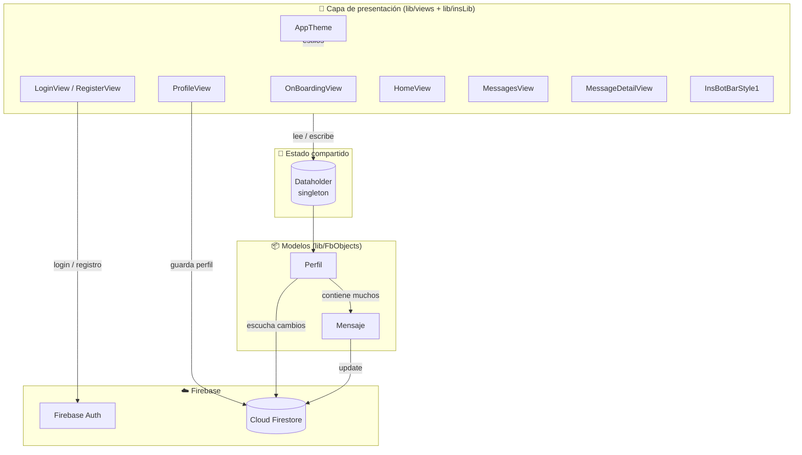

| Capa | Responsabilidad | Archivos |
|---|---|---|
| **Presentación** | Dibujar la interfaz y reaccionar a los toques del usuario | `views/*`, `insLib/*` |
| **Estado compartido** | Guardar datos que necesitan varias pantallas | `DataHolder.dart` |
| **Modelos** | Representar los datos y convertirlos a/desde Firestore | `FbObjects/*` |
| **Backend** | Autenticación y base de datos en la nube | Firebase |

---

## 🧭 Flujo de navegación

Todas las pantallas están registradas como **rutas con nombre** en `MiApp.dart`:

| Ruta | Pantalla |
|---|---|
| `/Onboardingview` | `Onboardingview` *(ruta inicial)* |
| `/LoginView` | `Loginview` |
| `/RegisterView` | `Registerview` |
| `/Profileview` | `Profileview` |
| `/HomeView` | `Homeview` |
| `/Messagesview` | `Messagesview` |
| `/MessageDetailview` | `Messagedetailview` |

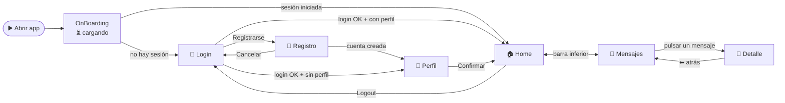

### `popAndPushNamed` vs `pushNamed`

La app usa dos formas de navegar. Es importante entender la diferencia:

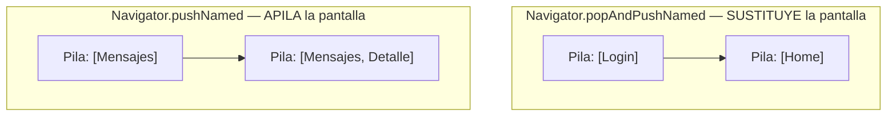

- **`popAndPushNamed`**: quita la pantalla actual y pone la nueva. No se puede volver atrás
  (tiene sentido tras hacer login: no queremos volver al login con el botón atrás).
- **`pushNamed`**: pone la nueva pantalla **encima**. El botón ⬅ del AppBar vuelve a la anterior.
  Se usa para abrir el **detalle de un mensaje**.

---

## ⏳ Arranque de la app (OnBoarding)

`OnBoardingView` es lo primero que se ve. Simula una carga en 3 pasos (barra de progreso) y
decide a qué pantalla ir:

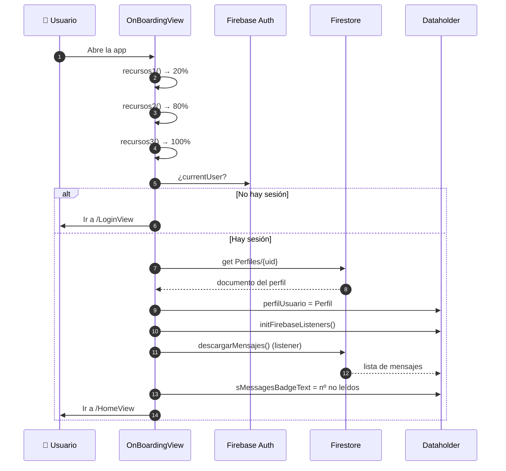

---

## 🖼 Las pantallas una a una

### 🔐 LoginView — Iniciar sesión
```
┌──────────────────────────┐
│ MI APP DAM2627           │  ← AppBar verde (tema global)
├──────────────────────────┤
│ ╭──────────────────────╮ │
│ │        (🔒)          │ │  ← tarjeta centrada
│ │       LOGIN          │ │
│ │ 👤 Usuario           │ │
│ │ 🔑 Contraseña ●●●●●● │ │
│ │ [█████ Login █████]  │ │  ← acción principal (FilledButton)
│ │     Registrarse      │ │  ← acción secundaria (TextButton)
│ ╰──────────────────────╯ │
└──────────────────────────┘
```
- Llama a `FirebaseAuth.signInWithEmailAndPassword`.
- Si el login es correcto, comprueba si existe `Perfiles/{uid}` en Firestore:
  **sí** → `HomeView`, **no** → `ProfileView`.
- Los errores (`user-not-found`, `wrong-password`) se capturan con `try / on FirebaseAuthException`.

### 📝 RegisterView — Crear cuenta
- Tres campos: usuario (email), contraseña y repetir contraseña.
- Si las contraseñas no coinciden, no hace nada (lo imprime por consola).
- Llama a `createUserWithEmailAndPassword` y, si va bien, va a `ProfileView`.

### 👤 ProfileView — Crear perfil
- Pide **edad** y **altura** dentro de una tarjeta, con los botones `[ Salir ]  [█ Confirmar █]`.
- Crea un objeto `Perfil` y lo guarda en `Perfiles/{uid}` con `toFirestore()`.
- Después navega a `HomeView`. El botón **Salir** cierra la app (`exit(0)`).

### 🏠 HomeView — Pantalla principal
```
┌──────────────────────────┐
│ ☰  HOMEVIEW          ⋮  │  ← menú lateral (Drawer) y menú de opciones
├──────────────────────────┤
│ ▓▓ BIENVENIDO <nombre> ▓▓│  ← cabecera con degradado verde
╰─┬──────────────────────┬─╯
  │ 👤 NOMBRE            │  ← tarjeta superpuesta: cambiar el nombre
  │ +# (###) ###-##-##   │  ← campo con máscara de teléfono
  │      ○ ○ ○ ○         │  ← PIN de 4 dígitos
  │ [█ Guardar █][Logout]│
  └──────────────────────┘
├──────────────────────────┤
│  🏠      🔔      💬(3)   │  ← barra inferior con badges
└──────────────────────────┘
```
- **Guardar** actualiza el nombre del perfil en Firestore.
- **Logout** cierra sesión (`FirebaseAuth.signOut()`) y vuelve a `LoginView`.
- Muestra ejemplos de paquetes externos: `mask_text_input_formatter` y `pin_input_text_field`.

### 💬 MessagesView — Lista de mensajes
```
┌──────────────────────────┐
│ ╭──────────────────────╮ │
│ │ 🐱  Título       ›   │ │  ← cada tarjeta es pulsable
│ │     Cuerpo (máx. 2…) │ │
│ ╰──────────────────────╯ │
│ ╭──────────────────────╮ │
│ │ 🐱  Título       ›   │ │
│ │     Cuerpo (máx. 2…) │ │
│ ╰──────────────────────╯ │
│                     (+)  │  ← añade un mensaje nuevo
├──────────────────────────┤
│  🏠      🔔      💬      │
└──────────────────────────┘
```
- Usa `ListView.separated` con un `itemBuilder` (`creadorDeItem`) y un `separatorBuilder`.
- Al entrar marca todos los mensajes como **leídos** y borra el badge.
- El botón ➕ crea un `Mensaje` y lo sube a Firestore.
- Al **pulsar una fila** se abre el detalle (ver [De la lista al detalle](#-de-la-lista-al-detalle)).
- Contiene también `crearGrid()`, un ejemplo de `GridView` que se deja para practicar.

### 🔎 MessageDetailView — Detalle de un mensaje
```
┌──────────────────────────┐
│ ⬅ Detalle del mensaje    │
├──────────────────────────┤
│ (✉)            [✓ Leído] │  ← cabecera con degradado verde
│ Título del mensaje       │
│ 🕒 01/10/2026 · 14:05    │
╰─┬──────────────────────┬─╯
  │ 📝 MENSAJE           │   ← tarjeta superpuesta (con animación)
  │ ──────────────────── │
  │ Cuerpo del mensaje,  │
  │ se puede seleccionar │
  │ y copiar.            │
  └──────────────────────┘
```
- Lee el mensaje elegido de `Dataholder.instance.mensajeSeleccionado`.
- Usa los tokens de `AppTheme.dart` y una animación de entrada con `TweenAnimationBuilder`.

### 🔻 InsBotBarStyle1 — Barra inferior
Widget reutilizable (`NavigationBar`) que comparten `HomeView` y `MessagesView`:

| Índice | Botón | Qué hace |
|---|---|---|
| 0 | 🏠 Principal | Va a `/HomeView` |
| 1 | 🔔 Notifications | Oculta el puntito (badge) de notificaciones |
| 2 | 💬 Messages | Borra el contador de no leídos y va a `/Messagesview` |

---

## 🔥 Modelo de datos en Firestore

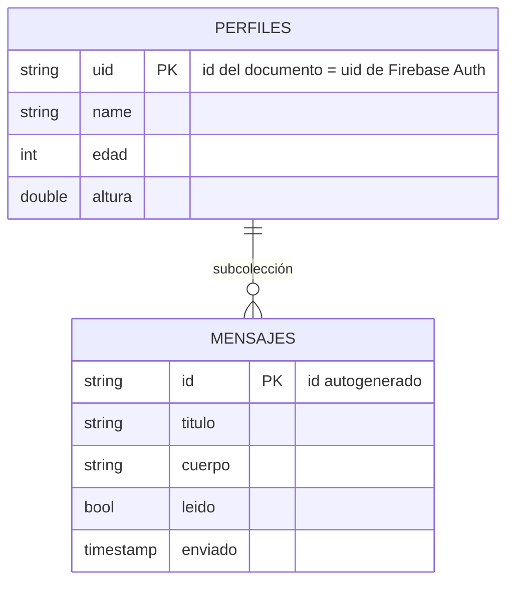

Rutas en la base de datos:

```
Perfiles/                      ← colección
└── {uid}                      ← documento (un perfil por usuario)
    ├── name: "Yony"
    ├── edad: 20
    ├── altura: 1.80
    └── Mensajes/              ← subcolección
        ├── {idMensaje1}
        │   ├── titulo: "Hola"
        │   ├── cuerpo: "..."
        │   ├── leido: false
        │   └── enviado: Timestamp
        └── {idMensaje2} ...
```

> 💡 El **id del documento del perfil es el mismo `uid`** que da Firebase Auth. Así, a partir del
> usuario con sesión iniciada se encuentra su perfil directamente: `Perfiles/{uid}`.

---

## 🧩 Clases del proyecto

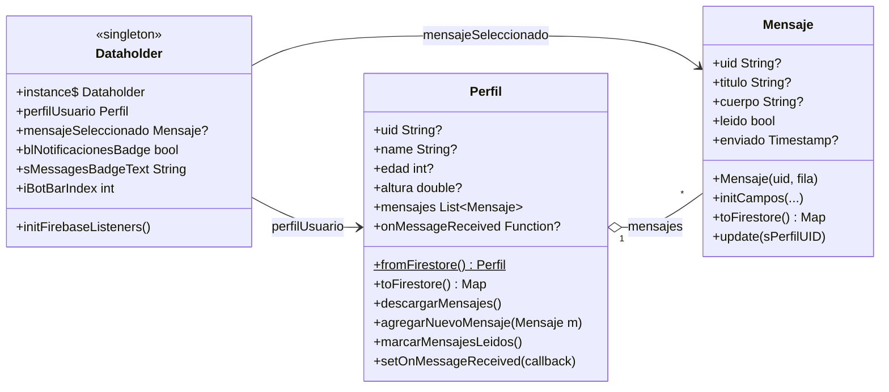

### Conversión entre objetos Dart y Firestore

Firestore guarda **mapas** (`clave: valor`). Los modelos tienen métodos para convertir en los dos
sentidos:

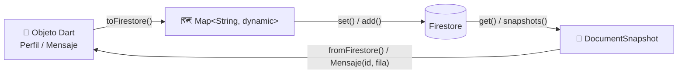

---

## 🧠 Estado compartido: `Dataholder`

Varias pantallas necesitan los mismos datos (el perfil, los badges, el mensaje elegido...).
En lugar de pasarlos de pantalla en pantalla, se guardan en **una única instancia** accesible
desde cualquier sitio: el patrón **Singleton**.

```dart
class Dataholder {
  Dataholder._();                                      // constructor privado: nadie más puede crear otro
  static final Dataholder instance = Dataholder._();   // la ÚNICA instancia
  ...
}

// Uso desde cualquier pantalla:
Dataholder.instance.perfilUsuario.name;
```

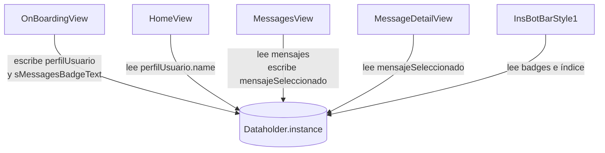

---

## 📡 Mensajes en tiempo real

`Perfil.descargarMensajes()` no descarga los mensajes una sola vez: se **suscribe** a la colección
con `snapshots().listen(...)`. Cada vez que cambia algo en Firestore (desde este móvil o desde
otro), se ejecuta el código del listener.

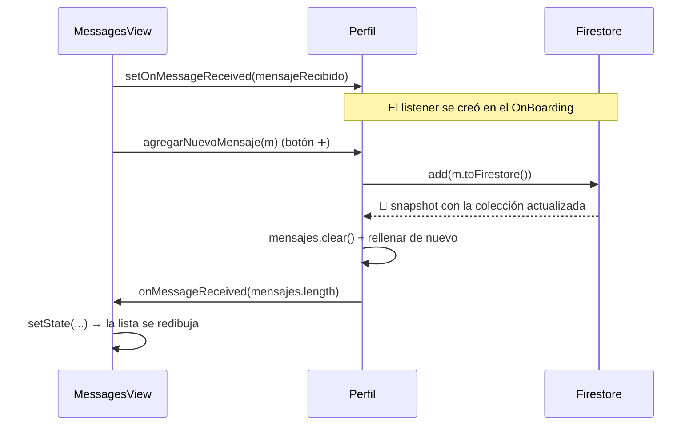

> 🔑 **Idea clave:** el **callback** `onMessageReceived` es cómo el modelo (`Perfil`) avisa a la
> vista (`MessagesView`) de que hay datos nuevos, sin que el modelo tenga que conocer la vista.

### Ciclo de vida de un mensaje

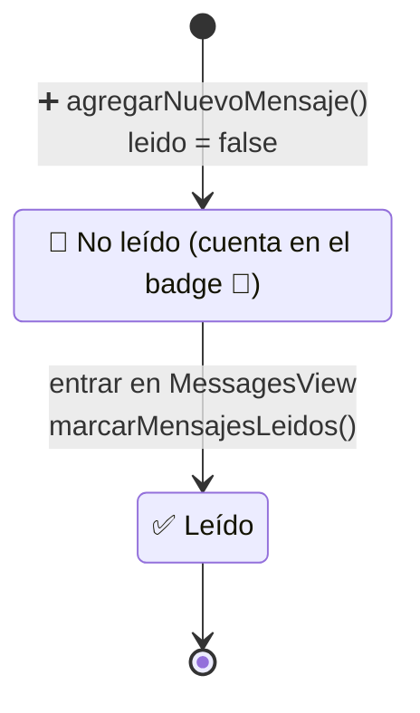

---

## 🔎 De la lista al detalle

Cómo funciona el paso de `MessagesView` a `MessageDetailView`:

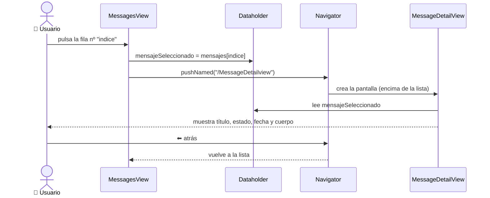

Código clave (en `MessagesView.creadorDeItem`):

```dart
return GestureDetector(
  onTap: () {
    Dataholder.instance.mensajeSeleccionado = Dataholder.instance.perfilUsuario.mensajes[indice];
    Navigator.pushNamed(context, "/MessageDetailview");
  },
  child: ... // el diseño de la fila
);
```

---

## 🎨 Sistema de estilos (tema)

En lugar de escribir colores y tamaños "a mano" en cada pantalla, se centralizan en
`lib/insLib/theme/AppTheme.dart` (**design tokens**). Si mañana cambia el color de la app,
se cambia en un solo sitio.

| Clase | Qué guarda | Ejemplo |
|---|---|---|
| `AppColores` | Paleta de colores | `AppColores.principal` (verde de la app) |
| `AppEspacios` | Márgenes y separaciones (4, 8, 16, 24, 32...) | `AppEspacios.md` |
| `AppRadios` | Redondeo de esquinas | `AppRadios.tarjeta` |
| `AppTextos` | Estilos de texto | `AppTextos.tituloCabecera` |

Además, `MiApp.crearTema()` construye un **`ThemeData` global** con esos tokens: AppBar, campos de
texto, botones, tarjetas, barra inferior, Drawer... Gracias a eso **cada pantalla apenas necesita
estilos propios**: un `TextField` o un `FilledButton` ya salen con el aspecto de la app.

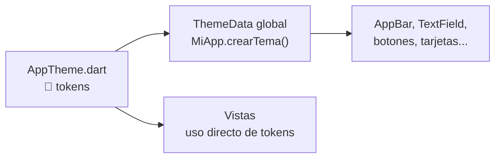

Paleta principal:

| Muestra | Token | Uso |
|---|---|---|
|  | `AppColores.principal` | AppBar, cabeceras, color de marca |
|  | `AppColores.oscuro` | Degradados, iconos destacados |

> ✍️ **Antes / después:** `Color.fromARGB(255, 146, 183, 123)` repetido en varios archivos
> → `AppColores.principal` definido una sola vez.

---

## 📦 Dependencias

| Paquete | Para qué se usa | Dónde |
|---|---|---|
| [`firebase_core`](https://pub.dev/packages/firebase_core) | Inicializar Firebase | `main.dart` |
| [`firebase_auth`](https://pub.dev/packages/firebase_auth) | Login, registro y logout | Login, Register, Home, OnBoarding |
| [`cloud_firestore`](https://pub.dev/packages/cloud_firestore) | Base de datos en tiempo real | Modelos, Profile, Home, Messages |
| [`mask_text_input_formatter`](https://pub.dev/packages/mask_text_input_formatter) | Campo con máscara de teléfono | `HomeView` |
| [`pin_input_text_field`](https://pub.dev/packages/pin_input_text_field) | Campo de PIN | `HomeView` |
| [`animated_bottom_navigation_bar`](https://pub.dev/packages/animated_bottom_navigation_bar) | Importado para practicar (no se usa todavía) | `HomeView` |
| [`flutter_quill`](https://pub.dev/packages/flutter_quill) | Editor de texto enriquecido (no se usa todavía) | — |
| [`cupertino_icons`](https://pub.dev/packages/cupertino_icons) | Iconos estilo iOS | — |

---

## 📚 Conceptos de Flutter que aparecen

| Concepto | Dónde verlo |
|---|---|
| `StatelessWidget` vs `StatefulWidget` | `LoginView` (stateless) vs `MessagesView` (stateful) |
| `setState()` para redibujar | `MessagesView.mensajeRecibido`, `OnBoardingView` (barra de progreso) |
| `initState()` | `OnBoardingView`, `MessagesView`, `HomeView` |
| Rutas con nombre | `MiApp.dart` |
| `TextEditingController` | Login, Register, Profile, Home |
| `async` / `await` / `Future` | Login, Register, OnBoarding, `Perfil` |
| `try` / `on ... catch` | `LoginView`, `RegisterView` |
| `Stream` y `listen` (tiempo real) | `Perfil.descargarMensajes()`, `Dataholder.initFirebaseListeners()` |
| Callbacks (funciones como parámetro) | `Perfil.setOnMessageReceived` |
| `ListView.separated` y `GridView.builder` | `MessagesView` |
| Patrón Singleton | `DataHolder.dart` |
| Widgets reutilizables con parámetros | `InsBotBarStyle1` |
| Animaciones implícitas | `MessageDetailView` (`TweenAnimationBuilder`) |
| Tema y design tokens | `AppTheme.dart`, `MiApp.dart` |

---

## 🛠 Ejercicios y mejoras propuestas

Puntos del código que se pueden mejorar. Son buenos ejercicios para clase:

- [ ] **Perfil inexistente en el OnBoarding:** `docSnap.data()!` lanza una excepción si el usuario
      tiene sesión pero no tiene perfil, así que la comprobación `perfilUsuario == null` nunca llega
      a cumplirse. ¿Cómo lo arreglarías?
- [ ] **Ruta inicial:** `MiApp` calcula `rutaInicial` pero luego usa siempre `"/Onboardingview"`.
- [ ] **Nombre fijo:** `ProfileView` guarda siempre `name: "Yony"`. Añade un campo para el nombre.
- [ ] **Mensajes de error al usuario:** los errores de login y registro solo salen por consola
      (`print`). Muéstralos con un `SnackBar`.
- [ ] **Validación de campos:** convertir edad y altura con `int.parse` / `double.parse` falla si el
      texto no es un número. Usa `tryParse` o un `Form` con validadores.
- [ ] **Teclado numérico:** los campos de edad y altura deberían usar `keyboardType: TextInputType.number`.
- [ ] **Idioma de la barra inferior:** "Notifications" y "Messages" están en inglés y el resto de la app en español.
- [ ] **`nombreController.text = "HOLA HOLA HOLA"`** está dentro de `build()` de `HomeView`, así que el campo se reinicia cada vez que la pantalla se redibuja.
- [ ] **Notificaciones:** el botón 🔔 de la barra inferior aún no abre ninguna pantalla.
- [ ] **Borrar mensajes:** añade la opción de eliminar un mensaje desde su detalle.
- [ ] **Modo oscuro:** añade un `darkTheme` usando los tokens de `AppTheme.dart`.
- [ ] **Código de plantilla:** `main.dart` todavía contiene `MyApp` y `MyHomePage` del proyecto
      de ejemplo de Flutter, que no se usan.

---

<p align="center">Hecho con 💚 en clase de DAM2 · Flutter + Firebase</p>
